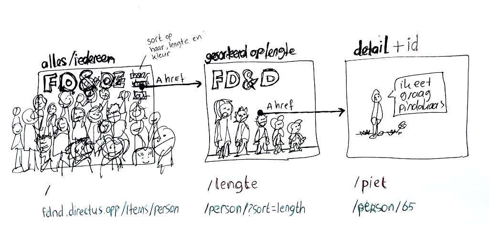

# Connect Your Tribe - Squad page

## Filteren en sorteren

In deze workshop leer je hoe je de data uit Directus kan filteren en sorteren en hoe je dit in je NodeJS project kan fetchen, en met Express en Liquid kan verwerken. 


### Aanpak

Afgelopen maandag hebben jullie ideeën bedacht voor jullie squadpage en zijn jullie begonnen met ontwerpen en bouwen. 
Waarschijnlijk ben je al begonnen met een prototype uitwerken in statische HTML. Misschien heb je al wat dynamische data uit de API gebruikt. 
Vandaag ga je meer leren over hoe je JSON data kan filteren en sorteren en gebruiken in je NodeJS project.

Vandaag gaan jullie eerst je teamleden helpen met het ophalen en gebruiken van de juiste data. 
Daarna gaan jullie eigen URLs, query parameters, routes en views bedenken en ontwerpen, met behulp van een wireflow.


## Vorderingen bespreken

Ga weer in de teams zitten waarin je maandag ingedeeld bent. Zet je naam op het bord, en schrijf achter je naam een titel voor het ontwerp dat je aan het maken bent. Schrijf eronder een vraag die je hebt (over Directus, JSON, NodeJS, Liquid, etc).

Leg elkaar je ontwerp en idee uit, en laat elkaar zien hoe ver je bent.

### API query parameters

Bespreek met elkaar welke API URL(s) je nodig hebt, en welke query parameters je daarin gebruikt hebt. 
Lees met elkaar de [`fields` query parameter van Directus](https://directus.io/docs/guides/connect/query-parameters#fields) en maak de API URL(s) zo klein mogelijk, zodat je alleen de data die je echt nodig hebt ook terugkrijgt. De ene zal misschien alleen namen en favoriete kleuren nodig hebben, de ander ook geboortedata en GitHub handles.

Als je lokaal een werkend prototype in HTML hebt, met de data die je nodig hebt, zet dan een krul achter je naam op het whiteboard. Als dat je nog niet is gelukt, vraag dan om hulp van je team. Als het je wel is gelukt, bied dan je hulp aan aan teamleden.

### Integreren naar Render

Push je eigen code naar GitHub, en zet je repository live met Render. Volg hiervoor [de stappen](https://github.com/fdnd-task/connect-your-tribe-profile-card/blob/main/docs/visitekaartje-met-nodejs.md#visitekaartje-integreren-en-live-testen) uit het Visitekaartje van vorige week. Help elkaar met Render als je er niet uit komt. Zet een tweede krul achter je naam als je de boel op Render hebt staan, en je jouw link hebt toegevoegd aan de About van je repository. Let op: je squad page hoeft nog niet “af” te zijn. We kiezen hier bewust voor deze fase van de development lifecycle.

#### Bronnen

- [Directus `fields` parameter](https://directus.io/docs/guides/connect/query-parameters#fields)
- [Integreren met Render (Sprint 7)](https://github.com/fdnd-task/connect-your-tribe-profile-card/blob/main/docs/visitekaartje-met-nodejs.md#visitekaartje-integreren-en-live-testen)


## Wireflow schetsen

In je ontwerp heb je een filter bedacht, of een sorteermogelijkheid. Dit is een interactie, die je net als in Sprint 5 en 6 met een Wireflow uit kunt werken. Toen deden we dit voor een micro-interactie, op de pagina zelf. Maar deze interactie is wat groter. Er moet waarschijnlijk nieuwe data opgehaald worden uit de API. Of de data moet net even anders gefilterd of gesorteerd worden, voordat je het weer toont.

Maak een Wireflow schets van jouw interactie. Gebruik [de workshop uit Sprint 5](https://github.com/fdnd-task/fix-the-flow-interactive-website/blob/main/docs/user-interface-design.md#wireflow). Heb je meerdere soorten filters of sorteermogelijkheden? Schets dan meerdere Wireflows.

### URL Design

We gaan voor deze interactie _terug naar jouw server_. De verschillende schermen van jouw interactie zijn op verschillende pagina's van jouw website beschikbaar. En elke pagina geeft andere HTML terug. De URLs van deze pagina's moet je dus ook _ontwerpen_, net als dat je bij een micro-interactie _feedforward_ en _feedback_ ontwerpt (en bouwt). Directus heeft in hun URL ontwerp een aantal keuzes gemaakt (met query parameters, zoals `filter`, `sort` en `fields`), maar die moet jij nu ook gaan maken voor je eigen squad page. Misschien wil je wel alleen maar Nederlandse URLs gebruiken bijvoorbeeld.

Als je bijvoorbeeld een Nederlandse squad page met hoofden aan het maken bent, waarop je kunt filteren op haarkleur, en kunt sorteren op haarlengte, kom je misschien wel tot de volgende URLs/routes voor je verschillende schermen (of pagina's):

| Pagina  | URL |
| --- | --- |
| Overzicht van alle hoofden | `/` |
| Filteren op bruin haar | `/?haarkleur=bruin` |
| Filteren op paars haar | `/?haarkleur=paars` |
| Filteren op geen haar | `/?haar=geen` |
| Sorteren op haarlengte, van kort naar lang | `/?gesorteerd=van-kort-naar-lang` |
| Sorteren op haarlengte, van lang naar kort | `/?gesorteerd=van-lang-naar-kort` |

Of je bedenkt dit:

| Pagina  | URL |
| --- | --- |
| Overzicht van alle hoofden | `/` |
| Filteren op bruin haar | `/bruin` |
| Filteren op paars haar | `/paars` |
| Filteren op geen haar | `/geen` |
| Sorteren op haarlengte, van kort naar lang | `/kort` |
| Sorteren op haarlengte, van lang naar kort | `/lang` |

Breid je Wireflows uit met eigen URLs. 
Schrijf ze onder je schermen met een andere kleur. 
Dit worden later de _routes_ in je server, dus je gaat ze nodig hebben.

In de Wireflow schets geef je aan welke URLs jouw pagina's nodig hebben (dat is wat de gebruiker in de adresbalk ziet), welke routes daarbij horen (die je aan moet maken in jouw `server.js`) en met welke query parameters je de data vanuit jouw server kan _fetchen_ bij Directus, onze _API_. 

Dat ziet er ongeveer zo uit:


Dit mag je dus helemaal zelf bedenken. 
Net wat je mooi vindt. 
Maar overleg hier wel even over met je team. 
Of vraag de mening van een docent. 
Je zult zien dat URLs ontwerpen toch best ingewikkeld is. #NamingThings

💪 Wil je al gebruik gaan maken van formulieren voor filters? Pas dan URL design toe op het `action` attribuut van je `<form>` en de verschillende `name` attributen van je `<input>` elementen. We zijn nu bezig met _`GET` requests_ (om gegevens _op te halen_). Volgende week komen hier ook _`POST` requests_ bij (om gegevens _op te slaan_).

#### Bronnen

- [User Interface Design - Wireflow (Sprint 5)](https://github.com/fdnd-task/fix-the-flow-interactive-website/blob/main/docs/user-interface-design.md#wireflow)
- [Guidelines for URI Design @ CSS Tricks](https://css-tricks.com/guidelines-for-uri-design/)


### Routes en query parameters

De volgende stap is het toevoegen van de _routes_ die je net hebt bedacht. En het gebruiken van de _query parameters_ die je verzonnen hebt. Gebruik de documentatie van Express om eerst wat hints hiervoor bij je Wireflows te zetten. Heb je bijvoorbeeld een `/paars` URL bedacht, zet daar dan ook `app.get('/paars', ...)` bij. Heb je een `/?sorteer=achternaam` URL bedacht, zet daar dan `app.get('/', ...)` bij. Query parameters lees je uit in die route. Breid je Wireflows uit met eigen routing hints.

Zet als extra hints bij je Wireflows ook welke data je denkt nodig te hebben uit de Directus API. Ga je iets met sorteren op lengte doen op een bepaalde pagina, zet dan bijvoorbeeld `sort=-length` bij dat scherm.

Bespreek de extra hints die je toegevoegd hebt binnen je team, zodat je een goed plan hebt om de code te kunnen schrijven.

Maak daarna net als vorige week verschillende routes aan, voor elk van de schermen in je Wireflow(s). Dit doe je in `server.js`. Je hebt al wat van ons gekregen, maar dat mag je natuurlijk aanpassen naar wat je zelf nodig hebt.

💪 Wil je al wat verder gaan met URL design? Kijk dan eens naar _Route parameters_ en `request.params` bij de Bronnen. Er staat al een voorbeeld met `/student/:id` voor je klaar in de server.

#### Bronnen

- [`app.get(path, callback)` @ Express](https://expressjs.com/en/5x/api.html#app.get.method)
- [`request.query` @ Express](https://expressjs.com/en/5x/api.html#req.query)
- [Route parameters @ Express](https://expressjs.com/en/guide/routing.html#route-parameters)
- [`request.params` @ Express](https://expressjs.com/en/5x/api.html#req.params)


### Voorbeeld van eigen query parameters gebruiken

Stel dat we een optie om andersom te sorteren op naam toe willen voegen aan onze squad page. En dat willen we op de URL `/?sorteer=andersom`. Op onze homepage dus, maar met de _query parameter_ `sorteer=andersom`.

Dit is de code waar we mee begonnen, die je van ons hebt gekregen:

```js
// Om Views weer te geven, heb je Routes nodig
// Maak een GET route voor de homepage
// Deze functie wordt dus uitgevoerd als de browser naar /?sorteer=andersom gaat
app.get('/', async function (request, response) {

  // Haal alle personen uit de WHOIS API op, van dit jaar, gesorteerd op naam
  const params = {
    // Sorteer op naam
    'sort': 'name',

    // Geef aan welke data je per persoon wil terugkrijgen
    'fields': '*,squads.*',

    // Combineer meerdere filters
    'filter[squads][squad_id][tribe][name]': 'FDND Jaar 1',
    'filter[squads][squad_id][cohort]': '2526',

    // Filter eventueel alleen op een bepaalde squad
    // 'filter[squads][squad_id][name]': '1I',
    // 'filter[squads][squad_id][name]': '1J',
  }
  const personResponse = await fetch('https://fdnd.directus.app/items/person/?' + new URLSearchParams(params))

  // [...]
})
```

Zoals we van onze Directus API weten, moeten we de URL van onze `fetch` dan aanpassen. Net als wanneer je dat rechtstreeks in de adresbalk van je browser doet. Maar nu doet NodeJS die `fetch` voor ons.

Dat zou bijvoorbeeld zo kunnen, met een [`if...else` statement](https://developer.mozilla.org/en-US/docs/Web/JavaScript/Reference/Statements/if...else):

```js
// Om Views weer te geven, heb je Routes nodig
// Maak een GET route voor de homepage
// Deze functie wordt dus uitgevoerd als de browser naar /?sorteer=andersom gaat
app.get('/', async function (request, response) {

  // Haal alle personen uit de WHOIS API op, van dit jaar, gesorteerd op naam
  const params = {
    // Geef de sortering nog niet mee, maar later

    // Geef aan welke data je per persoon wil terugkrijgen
    'fields': '*,squads.*',

    // Combineer meerdere filters
    'filter[squads][squad_id][tribe][name]': 'FDND Jaar 1',
    'filter[squads][squad_id][cohort]': '2526',

    // Filter eventueel alleen op een bepaalde squad
    // 'filter[squads][squad_id][name]': '1I',
    // 'filter[squads][squad_id][name]': '1J',
  }

  // Hier bekijken we welke sortering we mee willen geven aan de API
  // request.query is een object waar onze query parameters in zitten
  if (request.query.sorteer == 'andersom') {
    //^^^^^^^^^^^^^^^^^^^^^^^^^^^^^^^^^^^
    // Als we op /?sorteer=andersom zitten, voeg dan sort=-name toe
    params['sort'] = '-name'
    //^^^^^^^^^^^^^^^^^^^^^^
  } else {
    // En anders, voeg sort=name toe
    params['sort'] = 'name'
    //^^^^^^^^^^^^^^^^^^^^^
  }

  const personResponse = await fetch('https://fdnd.directus.app/items/person/?' + new URLSearchParams(params))

  // [...]
```

Of zo, met een [_ternaire operator_](https://developer.mozilla.org/en-US/docs/Web/JavaScript/Reference/Operators/Conditional_operator):

```js
// Om Views weer te geven, heb je Routes nodig
// Maak een GET route voor de homepage
// Deze functie wordt dus uitgevoerd als de browser naar /?sorteer=andersom gaat
app.get('/', async function (request, response) {

  // Haal alle personen uit de WHOIS API op, van dit jaar, gesorteerd op naam
  const params = {
    // Sorteer op naam
    'sort': (request.query.sorteer == 'andersom' ? '-name' : 'name'),
    //      ^^^^^^^^^^^^^^^^^^^^^^^^^^^^^^^^^^^^^^^^^^^^^^^^^^^^^^^^

    // Geef aan welke data je per persoon wil terugkrijgen
    'fields': '*,squads.*',

    // Combineer meerdere filters
    'filter[squads][squad_id][tribe][name]': 'FDND Jaar 1',
    'filter[squads][squad_id][cohort]': '2526',

    // Filter eventueel alleen op een bepaalde squad
    // 'filter[squads][squad_id][name]': '1I',
    // 'filter[squads][squad_id][name]': '1J',
  }
  const personResponse = await fetch('https://fdnd.directus.app/items/person/?' + new URLSearchParams(params))

  // [...]
```

Als je browser nu dus naar `/?sorteer=andersom` gaat op jouw website—een _request_ uitvoert—voert NodeJS voor jou de juiste `fetch()` naar de API uit.


### Data meegeven aan je Liquid views

Als laatste stap wordt de opgehaalde data als variabele meegegeven aan de Liquid view:

```js
response.render('index.liquid', {persons: personResponseJSON.data, squads: squadResponseJSON.data})
````

Hiermee wordt de code in jouw Liquid view uitgevoerd en als volledige HTML in de _response_ teruggegeven aan de browser. Dit noemen we _server-side rendering_. `persons` en `squads` zijn als _variabele_ beschikbaar in die view, en bevatten de JSON gegevens uit de API.


## Aan de slag met Liquid

Als je de juiste routes klaar hebt staan, je haalt de juiste data op de juiste plekken op, en je geeft de juiste data mee aan je Liquid views, kun je weer aan de slag met Liquid en frontend code.

Wees hier creatief, en zet dynamische content in voor het maken van een dynamische interface.

Een aantal voorbeelden staan hieronder:

### Liquid Tags

In Liquid kun je ook [`if` statements](https://liquidjs.com/tags/if.html) gebruiken:

```liquid

  

```

En [`else`](https://liquidjs.com/tags/if.html#elsif-else):

```liquid

  Bijnaam: {{ person.nickname }}

  Deze persoon heeft geen bijnaam

```

In de `index.liquid` die je van ons kreeg, zat het volgende:

```liquid
<ul>
  
    <li><a href="/student/{{ person.id }}">{{ person.name }}</a></li>
  
</ul>
```

Dit heet [een _for loop_](https://liquidjs.com/tags/for.html), waardoor je niet meerdere keren dezelfde HTML hoeft te schrijven. Liquid wandelt voor jou automatisch door alle personen heen, en _herhaalt voor élke persoon_ de HTML die je _in de loop_ zet. Zie ook dit voorbeeld:

```liquid

  <article>
    <h2>{{ person.name }}</h2>
    <p>{{ person.bio }}</p>
  </article>

```

Handiger dan statische HTML! Duik vooral eens in [wat er nog meer kan](https://liquidjs.com/tags/overview.html)!

En maak mooie dingen :)

#### Bronnen

- [The Liquid Template Language](https://liquidjs.com/tutorials/intro-to-liquid.html)
- [Liquid Filters](https://liquidjs.com/filters/overview.html)
- [Liquid Tags](https://liquidjs.com/tags/overview.html)
- [Liquid If](https://liquidjs.com/tags/if.html)
- [Liquid For](https://liquidjs.com/tags/for.html)
