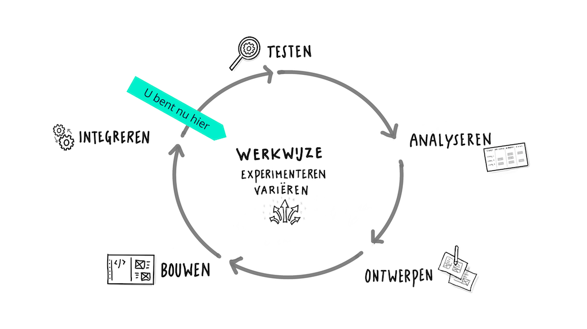

# Connect Your Tribe - Squad page

## Squad page ontwerpen

In deze workshop ga je met een team ideeën bedenken en uitwerken in een ontwerp. 

### Aanpak

<!--
Volgende technische stap die ik studenten wil leren: iets met query parameters voor GET requests. 

Volgende week dan forms, POST en de parallel naar query params voor POST requests. 

Kunnen we morgen oefenen met de query parameters/filters van Directus zelf (wat opdrachten aan de hand van de documentatie van Directus), en dan woensdag oefenen met query params in hun eigen routes toevoegen en gebruiken?
-->

Met een team van 3 ga je met de WHOIS data een website ontwerpen en maken, zodat je met elkaar in contact kan blijven. Met de website wil je op een (interactieve) manier mede-studenten kunnen opzoeken, gegevens bekijken, een student pingen, een vraag kunnen stellen, of iets anders.

Eerst gaan we teams maken en de Sprint Planning doorlopen. Daarna ga je met je team ideeën bedenken, ontwerpen en beginnen met bouwen. 

## Sprint Planning

Tijdens de Sprint Planning ga je met je team de opdracht analyseren.

### Team maken

Je wordt ingedeeld in een team van 3 studenten uit jouw squad. 

In welk team zit jij? Dat vind je in onze WHOIS API, bij je eigen gegevens.

Zoek in onze API eerst op in welk team jij zelf zit. Zoals je van vorige week nog weet, kun je in de volgende URL jouw ID aanpassen, en je eigen data als JSON bekijken: [https://fdnd.directus.app/items/person/234](https://fdnd.directus.app/items/person/234). Sinds vandaag is daar ook een `team` property bijgekomen, wat we voor deze opdracht gebruiken.

In Directus (wat we gebruiken voor onze API) kun je de JSON data sorteren, filteren en doorzoeken, aan de hand van _query parameters van de URL_. Een filter toepassen doe je door de query parameter `filter` mee te geven aan de URL. (Let op: dit is weer een _ander_ filter dan een Liquid filter.)

Met de volgende URL _filter_ je bijvoorbeeld op alle personen die in team “Rocket” zitten: [https://fdnd.directus.app/items/person/?filter[team]=Rocket](https://fdnd.directus.app/items/person/?filter[team]=Rocket). Pas deze URL aan, zodat je alle personen die in jouw team zitten te zien krijgt als JSON.

Ga daarna met je team aan een eigen tafel zitten en schrijf je naam en ID op het whiteboard.
Vul in de [WHOIS admin](https://whois.fdnd.nl/admin/) je favoriete kleur, favoriete HTML tag en attribuut, favoriete CSS property en favoriete JS feature in. <!--(Inmiddels zijn daar door verschillende ideeën van jullie nog een hoop extra velden bijgekomen.)-->

#### Bron

- Zie de documentatie van Directus over filteren: https://directus.io/docs/guides/connect/query-parameters#filter
- Kies je favo HTML uit de lijst [MDN HTML reference](https://developer.mozilla.org/docs/Web/HTML/Reference)
- Kies je favo CSS [MDN CSS reference](https://developer.mozilla.org/docs/Web/CSS/Reference)
- Kies je favo JS [MDN JS feature](https://developer.mozilla.org/docs/Web/API)

### Analyseren

Lees de instructies van de hele leertaak met je team door. Bespreek met jouw team wat je aan werk verwacht en maak een planning op basis van wat er op de programma website staat; welke workshops staan op het programma, wat heb je nodig voor de code/design review van komende vrijdag, en wat ga je presenteren tijdens de expo volgende week vrijdag?

### Team Canvas

Als je in een team gaat werken, is het belangrijk om afspraken te maken over de samenwerking, zodat alle teamleden goed op één lijn zitten. Vul met jouw team een Team Canvas in om een goed vertrekpunt voor jouw teamproject te hebben. 

Zorg ervoor dat je je eigen reflectie van Sprint 4 bij Samenwerken in Portflow doorneemt, en meeneemt in jullie teamafspraken. 
Je hebt toen tijdens de kampvuursessie gereflecteerd op wat er goed ging en wat er beter kon tijdens de Styleguide opdracht. 
Dit is een goed moment om deze inzichten met je nieuwe team te bespreken. 
Maak niet alleen afspraken over de hard skills (code, conventies, GitHub, commits, etc), maar ook over de soft skills (hoe gaan jullie communiceren, waar heb je moeite mee, welke feedback heb je op je assessment gehad, waar kun je hulp bij gebruiken, waar kun je anderen mee helpen, etc).

#### Bronnen Team Canvas

- [Workshop Team Canvas](https://github.com/fdnd-task/your-tribe-squad-page/blob/main/docs/team-canvas.md)

### Inrichten ontwikkelomgeving

Jullie gaan de eerste week op je _eigen_ repo werken. Vrijdag brengen jullie de ideeën samen en gaan jullie op 1 repo verder werken.

Als het goed is, heb je NodeJS al geïnstalleerd, dus dat hoef je niet nog een keer te doen. 

Fork allemaal deze leertaak, en *clone* deze op jouw computer.

Open deze leertaak in je editor, voer eerst een `npm install` uit om alle _afhankelijkheden_ voor dit project te installeren. Start daarna de voorbeeld squad page met het commando `npm start`. 

*Voor een stap voor stap uitleg over het Inrichten ontwikkelomgeving kan je nog even spieken bij [de workshop visitekaartje-met-nodejs van vorige week](https://github.com/fdnd-task/connect-your-tribe-profile-card/blob/main/docs/visitekaartje-met-nodejs.md#inrichten-ontwikkelomgeving)*

<!--Wat gaat er volgende week gebeuren met commits en pushen? Dan moet je wel even afspraken maken-->

Als iedereen van het team dit NodeJS project heeft draaien, ga dan samen verder met "ideeën bedenken".

## Ideeën bedenken

In de ontwerpfase ga je met je team verschillende ideeën voor de website bedenken en schetsen.

Het is belangrijk om eerst te weten wat je allemaal kan met de data uit de WHOIS API. 
Onderzoek met je team hoe je met Directus kunt sorteren, filteren en zoeken. 
Doe de opdrachtjes met je team op 1 computer, bespreek de opdrachtjes en schrijf op het whiteboard het antwoord en de techniek die jullie hebben toegepast:

<!--Met je team spelen met de Directus whois api...-->

### Sorteren

Sorteren betekent dat je de volgorde aanpast. Begin met alle personen die in de database zitten in een browser te tonen: https://fdnd.directus.app/items/person/

1) Hoe is deze lijst standaard gesorteerd?

Je kunt op alle velden in de WHOIS API sorteren.

Sorteer nu de lijst alfabetisch, voeg de _query parameter_ `sort=name` toe aan de URL in je browser, waardoor je `https://fdnd.directus.app/items/person/?sort=name` krijgt.

2) Wie is de eerste persoon als je op naam sorteert?

3) Wie is het oudst bij FDND? Sorteer hiervoor op geboortedag, `birthdate`.

4) Wie is de jongste op de lijst? (Hint: Je kunt de `sort` _order_ omdraaien. Kijk op https://directus.io/docs/guides/connect/query-parameters#sort hoe dat moet.)

5) Wat zou handig zijn om écht de jongste op de lijst te krijgen?

### Filteren

Filteren van data hebben we hierboven al een keer gedaan. Je zocht net op alle personen _die een bepaald team hebben_. Als je data filtert, krijg je een _deelverzameling_.

6) Filter eens op alle studenten die als favoriete HTML element `<body>` hebben ingevuld; gebruik hiervoor `filter[fav_tag]=<body>` in de URL. Hoeveel zijn dat?

7) Filter daarna eens op het HTML element dat jij zelf hebt ingevuld. Hoeveel hebben dezelfde als jij?

8) Filter op alle studenten die als favoriete kleur rood hebben ingevuld; gebruik hiervoor `filter[fav_color]=red`.

Oh wacht ... dat werkt niet, je moet de volledige kleurcode hiervoor invullen. Let op: `#` doet het niet, gebruik daarvoor `%23`, waarmee je het `#` karakter in de URL _escaped_ hebt. Voor `red` heb je dus `%23ff0000` nodig. Lukt het nu?

9) Waar kan je nog meer op filteren? Filter op alle mensen in de database van wie de naam begint met een `k`. Gebruik hiervoor de query parameter `filter[name][_starts_with]=K` in de URL. Hoeveel zijn dit er?

10) Je kunt dus ook nog _filter rules_ meegeven aan Directus. Wat kan je hier nog meer mee doen? Check https://directus.io/docs/guides/connect/filter-rules en probeer er een paar uit. Schrijf wat je hebt geleerd op het whiteboard. 

11) Filter nu op alle studenten die in hun bio het woord "frontend" hebben staan. Hoeveel zijn dat er? Frontenders ahoy!

<!-- filter[bio][_icontains]=frontend -->

Filters en sortering kun je combineren, met de `filter` en `sort` query parameters. Meerdere query parameters splits je met het `&`-teken, de eerste query parameter van een URL krijgt een `?` ervoor.

12) 💪 Wie is de jongste persoon bij FDND? (Hint: combineer sorteren op geboortedatum met filteren op `null`)

<!-- filter[birthdate][_nnull]=true&sort=-birthdate -->

### Zoeken

Je kunt ook zoeken in de database. De zoekfunctie van Directus speurt in alle velden. 

Zoek maar eens op een hobby, gebruik hiervoor de query parameter `search=frisbee` in de URL. Weer geen interessante mensen gevonden? Zoek dan maar op je eigen naam ... ego. Bron: https://directus.io/docs/guides/connect/query-parameters#search

13) Schrijf 3 termen op waar je op gezocht hebt, en zet daarbij hoeveel personen je gevonden hebt.

### Schetsen

Nu je een beetje hebt gespeeld met filteren, sorteren en zoeken, kunnen jullie misschien wel wat ideeën bedenken hoe je alle frontenders in de database zou kunnen tonen en wat leuke filters zijn om te laten zien. 

<!-- Met de website wil je op een (interactieve) manier mede-studenten kunnen opzoeken, gegevens bekijken, een student pingen, een vraag kunnen stellen, of iets anders. -->

Schets allemaal 6 eigen ideeën op papier voor het tonen, sorteren en filteren van de frontenders. 
Eerst bedenk je met je team verschillende ideeën voor jullie website. Je kan hiervoor de formulier velden gebruiken die al bestaan. Maar misschien heb je nog een veel beter of gekker idee? Dan kunnen we ook nieuwe velden toevoegen!

Bespreek de schetsen en werk daarna 6 verschillende ideeën uit op het whiteboard. Noteer bij elk idee hoe je de data kunt filteren of sorteren, en welke velden in de WHOIS API je daarvoor nodig hebt, of moeten worden aangemaakt. 

Kies daarna allemaal een eigen idee om deze week aan te werken. Maak in een gezamenlijk Figma file allemaal een eigen een high-res ontwerp van je idee. Help elkaar met styling, gebruik dezelfde stijl elementen of bedenk zelf een stijl.

Vrijdag ga je met je team kijken wat jullie hebben gemaakt en maken jullie een nieuw ontwerp om daarna gezamenlijk aan te werken.

<!-- In de eerste week van deze opdracht ideeen bedenken met whois data, leren hoe je  met directus kan filteren en sorteren. (get)
In de de tweede leren hoe je data kan opslaan (POST) en op 1 codebase werken. 
-->

## Iteratief werken

Met je team ga je iteratief aan de opdracht werken. Dat betekent dat jullie eerst zelf verschillende ideeën gaan uitwerken in code. Deze ga je bespreken en vervolgens breng je dit samen in een nieuw ontwerp. De code uit deze repository geeft je een heel basic begin van een squad page. Het is natuurlijk de bedoeling dat je deze code van jezelf maakt en helemaal aanpast naar het eigen idee dat je hebt.

Door de DLC meerdere keren te doorlopen, kan je stap voor stap een ontwerpprobleem, of ontwerpvraag, oplossen.

Dit heet ook wel “divergeren en convergeren”. Eerst werken jullie verschillende ideeën uit, experimenteer met technieken, design en/of de interface, daarna analyseren wat goed werkt en er mooi uit ziet, keuzes maken, en een nieuwe iteratie beginnen om tot de beste oplossing te komen. 

