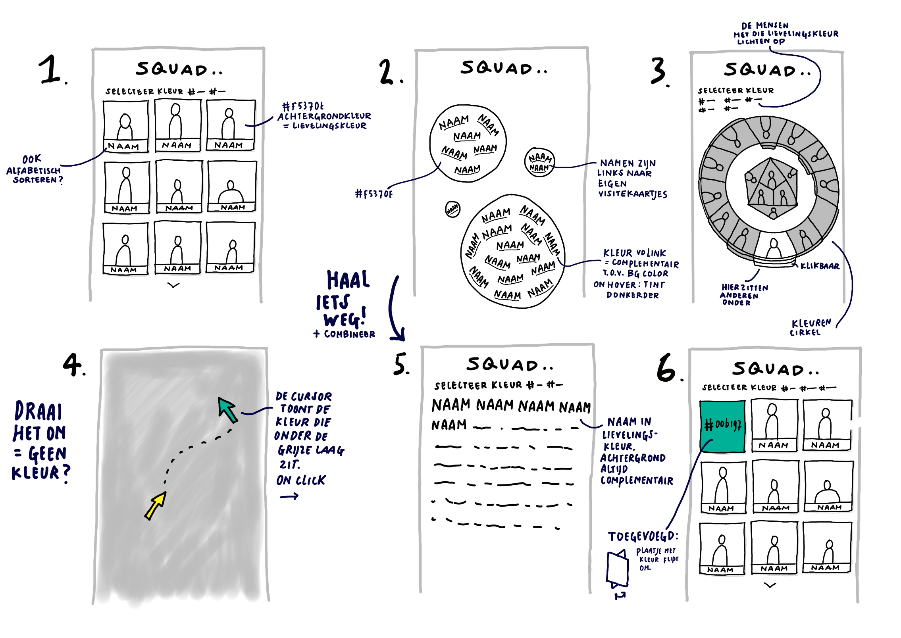

# Connect Your Tribe - Squad page

## Squad page ontwerpen

In deze workshop ga je met een team ideeën bedenken en uitwerken in een ontwerp. 

### Aanpak

<!--
Volgende technische stap die ik studenten wil leren: iets met query parameters voor GET requests. 

Volgende week dan forms, POST en de parallel naar query params voor POST requests. 

Kunnen we morgen oefenen met de query parameters/filters van Directus zelf (wat opdrachten aan de hand van de documentatie van Directus), en dan woensdag oefenen met query params in hun eigen routes toevoegen en gebruiken?
-->

Met een team van 3 ga je met de WHOIS data een website ontwerpen en maken, zodat je met elkaar in contact kan blijven. Met de website wil je op een (interactieve) manier mede-studenten kunnen opzoeken, gegevens bekijken, een student pingen, een vraag kunnen stellen, of iets anders.

Eerst gaan we teams maken en de Sprint Planning doorlopen. Daarna ga je met je team 
ideeën bedenken, ontwerpen en beginnen met bouwen. 

## Sprint Planning

Tijdens de Sprint Planning ga je met je team de opdracht analyseren.

### Team maken

Je wordt ingedeeld in een team van 3 studenten uit jouw squad. 

In welk team zit jij? Dat vind je in de (Directus) API.

Zoek in onze API eerst op in welk team jij zelf zit. Zoals je van vorige week nog weet, kun je jouw ID aanpassen op [https://fdnd.directus.app/items/person/?filter={"id":234}](https://fdnd.directus.app/items/person/?filter={"id":234}). Sinds gisteren is daar ook een `team` property bijgekomen, wat we voor deze opdracht gebruiken.

In Directus kun je de JSON data sorteren, filteren en doorzoeken, aan de hand van _query parameters van de URL_. Een filter toepassen doe je door de query parameter `filter` mee te geven aan de URL. Dat deed je eerder al met een `filter` op één ID: `{"id":234}`. Let op: dit is weer een _ander_ filter dan een Liquid filter.

Met deze URL filter je bijvoorbeeld op alle personen die in “Team Rocket” zitten: [https://fdnd.directus.app/items/person/?filter={"team":"Team Rocket"}](https://fdnd.directus.app/items/person/?filter=%7B%22team%22:%22Team%20Rocket%22%7D). Pas deze URL aan, zodat je alle personen die in jouw team zitten te zien krijgt.

Ga daarna met je team aan een eigen tafel zitten en schrijf je naam en ID op het whiteboard.
Vul daarna in de [WHOIS admin](https://whois.fdnd.nl/admin/) je favoriete design kleur, favoriete HTML tag en attribuut, favoriete CSS property en JS feature in.

#### Bron

- Zie de documentatie van Directus over filteren: https://directus.io/docs/guides/connect/query-parameters#filter
- Kies je favo HTML uit de lijst [MDN HTML reference](https://developer.mozilla.org/docs/Web/HTML/Reference)
- Kies je favo CSS [MDN CSS reference](https://developer.mozilla.org/docs/Web/CSS/Reference)
- Kies je favo JS [MDN JS feature](https://developer.mozilla.org/docs/Web/API)

### Analyseren

Lees de instructies van de hele leertaak met je team door. Bespreek met jouw team wat je aan werk verwacht en maak een planning op basis van wat er op de programma website staat, welke workshops staan op het programma, wat heb je nodig voor de code/design review van vrijdag, en wat ga je presenteren tijdens de expo volgende week vrijdag?

### Team Canvas

Als je in een team gaat werken, is het belangrijk om afspraken te maken over de samenwerking, zodat alle teamleden goed op één lijn zitten. Vul met jouw team een Team Canvas in om een goed vertrekpunt voor jouw teamproject te hebben. 

Zorg ervoor dat je je reflectie van Sprint 4 in Portflow doorneemt, en meeneemt in jullie teamafspraken. Je hebt toen tijdens de kampvuursessie gereflecteerd op wat er goed ging en wat er beter kon. Dit is een goed moment om deze inzichten met je nieuwe team te bespreken. Maak niet alleen afspraken over de hard skills (code, conventies, GitHub, commits, etc), maar ook over de soft skills (hoe communiceren we, op welke dagen werken we, waar heb je moeite mee, welke feedback heb je op je assessment gehad, waar kun je hulp bij gebruiken, waar kun je anderen mee helpen, etc).

#### Bronnen Team Canvas

- [Workshop Team Canvas](https://github.com/fdnd-task/your-tribe-squad-page/blob/main/docs/team-canvas.md)

### Inrichten ontwikkelomgeving

Jullie gaan de eerste week op je eigen repo werken. Vrijdag brengen jullie de ideeën samen en gaan jullie op 1 repo verder werken. 

Als het goed is, heb je NodeJS al geïnstalleerd, dus dat hoef je niet nog een keer te doen. 

Fork deze leertaak van [connect-your-tribe-squad-page](https://github.com/fdnd-task/connect-your-tribe-squad-page/) en *clone* deze op jouw computer.

Open deze leertaak in Visual Studio Code, voer eerst een `npm install` uit om alle _afhankelijkheden_ voor dit project te installeren. Start daarna de voorbeeld squad page met het commando `npm start`. 

*Voor een stap voor stap uitleg over het Inrichten ontwikkelomgeving kan je nog even spieken bij de workshop visitekaart-met-nodejs van vorige week*

<!--Wat gaat er volgende week gebeuren met commits en pushen? Dan moet je wel even afspraken maken-->

Als iedereen van het team dit NodeJS project heeft draaien, ga dan samen verder met "ideeën bedenken".

## Ideeën bedenken

In de ontwerpfase ga je met je team verschillende ideeën voor de website bedenken en schetsen.

Het is belangrijk om eerst te weten wat je allemaal kan met de data uit de WHOIS API. 
Onderzoek met je team hoe je met Directus kan sorteren, filteren en zoeken. 
Doe de opdrachtjes met je team op 1 computer, bespreek de opdrachtjes en schrijf op het whiteboard het antwoord en de techniek die jullie hebben toegepast:

<!--Met je team spelen met de Directus whois api...-->

### Sorteren

Sorteren betekent dat je de volgorde aanpast. Begin met alle personen die in de database zitten in een browser te tonen: https://fdnd.directus.app/items/person/

Hoe is deze lijst gesorteerd?

<!-- Op Id. -->

Je kunt op alle velden van de WHOIS sorteren.

Sorteer nu de lijst alfabetisch, voeg de query parameter `sort=name` toe aan de url in je browser. (Meerdere query parameters combineer je door het `&` teken, de eerste query parameter krijgt een `?`)

Wie is het oudst bij FDND? Sorteer op geboortedag, voeg de parameter `sort=birthdate` toe. 

Wie is de jongste op de lijst? Je kan de sort order omdraaien. Kijk op https://directus.io/docs/guides/connect/query-parameters#sort hoe dat moet.

### Filteren

Filteren van data hebben we al een keer gedaan. Als je data filtert, krijg je een deelverzameling.

Filter eens op alle studenten die als favoriete HTML element `<body>` hebben ingevuld; gebruik hiervoor `filter={"fav_tag":"<body>"}` in de URL. Aj, zijn er geen interessante mensen die de body tag hebben ingevuld? Filter dan op het HTML element dat jij zelf hebt ingevuld. Nu krijg je alle mensen die dit element hebben ingevuld. Wie heeft dezelfde als jij?

Filter op alle studenten die als favoriete kleur rood hebben ingevuld; gebruik hiervoor `filter={"fav_color":"red"}`.

Oh wacht ... dat werkt niet, je moet de volledige kleurcode hiervoor invullen. Let op: `#` doet het niet, gebruik daarvoor `%23`, waarmee je het `#` karakter in de URL _escaped_ hebt. Lukt het nu?

Waar kan je nog meer op filteren? Filter op alle mensen in de database van wie de naam begint met een `k`. Gebruik hiervoor de parameter `filter={"name":{"_starts_with":"K"}}` in de URL.

Je kunt dus ook nog _filter rules_ meegeven aan Directus. Wat kan je hier nog meer mee doen? Check https://directus.io/docs/guides/connect/filter-rules en probeer er een paar uit. Schrijf wat je hebt geleerd op het whiteboard. 

Filter nu op alle studenten die in hun bio het woord "frontend" hebben staan. Frontenders ahoy!

<!-- `?filter={"bio":{"_icontains":"frontend"}}` -->

### Zoeken

Je kunt ook zoeken in de database. De zoekfunctie van Directus speurt in alle velden. 

Zoek maar eens op een hobby, gebruik hiervoor de parameter `search=frisbee` in de URL. Weer geen interessante mensen gevonden? Zoek dan maar op je eigen naam ... ego.

<!--
**Oefenen met de query parameters/filters van Directus zelf (wat opdrachten aan de hand van de documentatie van Directus)**
Woensdag oefenen met query params in hun eigen routes toevoegen en gebruiken? 
-->

### Schetsen

Nu je een beetje hebt gespeeld met filteren, sorteren en zoeken, kunnen jullie misschien wel wat ideeën bedenken hoe je alle frontenders in de database zou kunnen tonen en wat leuke filters zijn om te laten zien. 

<!-- Met de website wil je op een (interactieve) manier mede-studenten kunnen opzoeken, gegevens bekijken, een student pingen, een vraag kunnen stellen, of iets anders. -->

Eerst bedenk met je team verschillende ideeën voor jullie website. Je kan hiervoor de formulier velden gebruiken die al bestaan. Maar misschien heb je nog een veel beter of gekker idee? Dan kunnen we ook nieuwe velden toevoegen!

Schets met je team minimaal 6 verschillende ideeën op het whiteboard. Noteer bij elk idee hoe je de data kan filteren of sorteren, en welke velden in de WHOIS API je daarvoor nodig hebt, of moeten worden aangemaakt. 

Kies daarna allemaal een idee om deze week aan te werken. Maak in een gezamenlijk Figma file een high-res ontwerp van je idee. Help elkaar met styling en gebruik dezelfde stijl elementen. 

Vrijdag ga je met je team kijken wat jullie hebben gemaakt en maken jullie een nieuw ontwerp om daarna gezamenlijk aan te werken. 

<!-- In de eerste week van deze opdracht ideeen bedenken met whois data, leren hoe je  met directus kan filteren en sorteren. (get)
In de de tweede leren hoe je data kan opslaan (POST) en op 1 codebase werken. 
-->

<!--
### Analyseren

In de analysefase inventariseer je wat er moet gebeuren om een taak uit te voeren en formuleer je een aantal uitgangspunten waar je ontwerp aan moet voldoen. 

1. Lees de instructies van deze leertaak zorgvuldig door.
2. Onderzoek wat je allemaal kan doen met de [WHOIS API](https://whois.fdnd.nl).
3. Bespreek met jouw team wat je aan werk verwacht, en vul een [teamvanvas](https://github.com/fdnd-task/your-tribe-team-canvas) in
4. Bedenk hoe jullie gaan samenwerken en plan de belangrijke momenten in. Gebruik Github Projectboard om dit te organiseren

#### Bronnen

- [WHOIS API](https://whois.fdnd.nl)
- [Learn about projects on Github](https://docs.github.com/en/issues/planning-and-tracking-with-projects/learning-about-projects/about-projects)
- [teamvanvas](https://github.com/fdnd-task/your-tribe-team-canvas)

### Bouwen
In de bouwfase werken alle teamleden een ander idee uit met Node en JSON.

 1. Fork deze leertaak en clone deze op jouw computer.
 2. Open deze leertaak in jouw editor (bijv. Visual Studio Code).
 3. Open de terminal en voer het commando `npm install` in. Je gebruikt NPM om Express inclusief alle afhankelijkheden te installeren.
 4. Start je server met `npm start`, en onderzoek wat de code op dit moment doet.
 5. Pas alles aan naar eigen wens.

#### Bronnen

- [JSON](https://developer.mozilla.org/en-US/docs/Web/JavaScript/Reference/Global_Objects/JSON)
- [EJS - Embedded JavaScript templating](https://ejs.co)
- [Control Flow in JavaScript: Loops](https://dev.to/pszponder/control-flow-in-javascript-loops-26bd)

### Integreren
Als je online wil testen moet je je project publiceren op internet. Omdat we met Node werken, kan dat niet met GitHub Pages, omdat daar alleen statische pagina's kunnen worden gehost. Voor een Node project moet een serveromgeving opgestart worden. Wij gebruiken cyclic.sh als hostingpartij maar je mag natuurlijk je eigen voorkeur volgen als die anders is.

1. Commit en Push jouw project naar GitHub
2. Login bij [cyclic.sh](https://www.cyclic.sh/)
3. Klik op Deploy om een nieuwe App aan te maken
4. Selecteer het tabblad _Link Your Own_ om jouw project te publiceren.
5. Zoek de juiste repository. Cyclic importeert jouw code en voert `npm start` uit.
6. Er wordt een unieke naam voor jouw project gegenereerd. Op jouw Cyclic pagina zie je alle apps die je hebt aangemaakt
7. Open je squad page in je browser, check of alles werkt en voeg de url van de App toe aan jouw repository op GitHub. 

#### Bronnen

- [Cyclic Hosting](https://www.cyclic.sh/)

### Testen
In de testfase controleer je of jouw website voldoet aan standaarden. 
Jouw team kiest daarna het beste, mooiste of meest originele ontwerp en deze presenteren jullie aan de squad. 
-->
