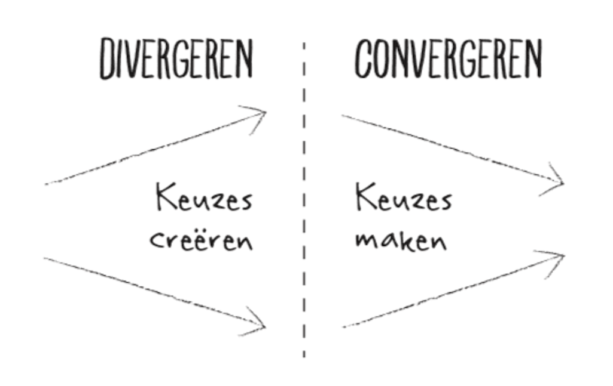

# Connect Your Tribe - Squad page

## User Generated Content

In deze workshop leer je hoe je data naar Directus kan posten met behup van een formulier.

### Aanpak

Vandaag gaan we de eerste stappen zetten met het _opslaan_ van gegevens. Afgelopen weken heb je uit de API alleen gegevens _opgehaald_ via een _`GET` request_. Deze week komt opslaan via een _`POST` request_ daar dus bij.

We gaan eerst oefenen met een simpel formulier en een _`POST` request_. Daarna ga je met je team aan de slag om _samen_ één nieuwe squad page te ontwerpen. Hierbij gaan jullie ook rekening houden met _User Generated Content_. Al jullie ideeën voegen jullie samen tot één nieuwe squad page, die jullie komende vrijdag aan de andere teams gaan laten zien tijdens de expo.

## GET vs POST

Tot nu toe heb je—misschien onbewust—vooral met `GET` requests gewerkt. Zowel in je eigen NodeJS server, als bij de API calls naar onze WHOIS database in Directus. Vandaag komen daar `POST` requests bij.

### HTTP
Maar eerst moeten we wat meer vertellen over _HTTP_.

HTTP is een _protocol_ waarmee browsers tegen servers kunnen praten. HTTP maakt gebruik van URLs; adressen van _resources_, zoals HTML, CSS, afbeeldingen, fonts, JSON bestanden, etc. Een browser kan zo'n URL via HTTP binnenhalen (_fetchen_). En onze NodeJS server kan een URL via HTTP binnenhalen van bijvoorbeeld Directus. URLs voor je eigen server en website mag je zelf bepalen, via _routing_. URLs binnen Directus staan redelijk vast. Tot zover niks nieuws.

### `GET`
Voor elke URL die je opvraagt, moet je ook bepalen met welke _method_ dat gebeurt. Standaard is dat `GET`. Elk adres dat je invoert jn je browser, en elke `<a href="/een-url">` link die je bezoekt, zorgt voor een `GET` request. `GET` requests halen alleen gegevens op: `GET /something`, that's it.

### `POST`
Bij het maken van een `<form action="/een-url">` kun je de method veranderen naar `method="POST"`, waarmee je aangeeft dat je iets gaat veranderen. Je wilt nieuwe gegevens opslaan, een bericht toevoegen, een like uitdelen aan een recept, of een product toevoegen aan je wensenlijst. Al deze acties zorgen voor _User Generated Content_, en daarvoor hebben we dus `POST` requests nodig.

Als frontender heb je vooral te maken met `POST` requests als je formulieren ontwerpt en maakt. Bedenk hierbij dat eigenlijk alles wat iets verandert in een database een formulier nodig heeft. Ook als dat formulier niet als een standaard formulier met invoervelden is ontworpen. Denk hierbij aan “Add to cart” buttons, “Like” buttons, “Favorite” buttons, etc. Je houdt hier rekening mee als je een ontwerp omzet naar HTML.

🔎 Om het ingewikkelder te maken: niet elk `<form>` hoeft een `POST` te doen. Je kunt natuurlijk ook `GET` requests uitvoeren vanuit een formulier. Denk aan een zoekformulier met één `<input type="search">`, of een filter met radio's en checkboxjes; deze veranderen niks op de server, dus voor dit soort formulieren gebruik je `<form method="GET">`.

⏯️ En nog ingewikkelder: niet elke `<button>` hoeft altijd een `POST` request uit te voeren, of in een `<form>` te staan. Sommige knoppen voeren een micro-interactie uit, zoals je in Sprint 5 hebt geleerd. Hoe meer je werkt met formulieren en User Generated Content, hoe beter je leert inschatten wanneer je wat moet gebruiken.

### Bronnen

- [What's HTTP?](https://wizardzines.com/comics/whats-http/)
- [Anatomy of an HTTP request](https://wizardzines.com/comics/anatomy-http-request/)
- [HTTP request methods](https://wizardzines.com/comics/request-methods-1/)
- [HTTP status codes](https://wizardzines.com/comics/status-codes/)

## Oefenen met een POST

Om te oefenen, gaan we een pagina met een formulier toevoegen aan onze squad page. Hiermee kunnen we berichten achterlaten.

Maak in je squad-page repository in `server.js` een nieuwe `messages` _array_ aan. Hierin gaan we berichten opslaan.

Maak ook een nieuwe `GET` route aan in `server.js`, bijvoorbeeld naar `/berichten`. Laat op deze route een nieuwe view renderen, bijvoorbeeld `messages.liquid`, en geef de `messages` array mee aan die view.

Maak in `messages.liquid` een formulier aan. Geef het formulier `method="POST"` als attribuut. Voeg een invoerveld met de naam `message` en een submit button toe. Alleen formuliervelden met een `name` attribuut worden in een `POST` request meegestuurd door de browser.

Laat onder het formulier alle huidige berichten zien, in een Liquid `for` loop. Als het goed is, is deze nog leeg.

Voer `npm start` uit, open de pagina die je net aangemaakt hebt, en controleer of je daar jouw formulier te zien krijgt. Probeer ook wat content toe te voegen.

Als het goed is, krijg je een foutmelding, dat je nog niet kunt `POST`en naar deze pagina. Dit komt doordat je nog geen `POST` route hebt klaargezet in je server. De server luistert alleen naar `GET` requests voor die URL.

In `server.js` staat al een een `POST` route naar `/` klaar. Pas deze route, en de redirect erbinnen, aan naar bijvoorbeeld `/berichten`. Herstart je server, en controleer of je formulier nu wel verstuurd kan worden.

Om de boel ook echt dynamisch te maken, kun je in de `POST` route nu `request.body.message` toevoegen aan de `messages` array. Herstart hierna je server om je allereerste `User Generated Content` te testen.

Elke keer dat je je server herstart, wordt de `messages` array opnieuw aangemaakt. Je begint in dit geval dus steeds met een schone lei, wat niet ideaal is. Een volgende stap is deze data opslaan in een database, bijvoorbeeld via onze WHOIS API. Hier komen we later vandaag aan toe. Het principe is alleen precies hetzelfde: via een `<form>` en een `POST` route stuur je gegevens vanuit de browser naar een server. Wat die server er vervolgens mee doet, verschilt natuurlijk per website.

Daarom gaan we eerst een nieuwe website ontwerpen.

### Bronnen

- [Basic routing in Express](https://expressjs.com/en/starter/basic-routing.html)
- [`<form>`: The Form element @ MDN](https://developer.mozilla.org/en-US/docs/Web/HTML/Element/form)
- [For loop in Liquid](https://liquidjs.com/tags/for.html)

## Kill Your Darlings (Ouch!)

Itereren betekent het herhalen en verbeteren van een ontwerp of product, op basis van feedback en nieuwe inzichten. Dit zorgt ervoor dat je stap voor stap tot een beter resultaat komt. In de _development lifecycle_ is iteratie essentieel: het zorgt voor een continue cyclus van ontwerpen, ontwikkelen, testen en verbeteren, wat leidt tot een gebruiksvriendelijker en beter functionerend eindproduct.

De week voor de vakantie hebben jullie hier al mee geoefend: Jullie hebben zes ideeën geschetst voor de squad page en één daarvan verder uitgewerkt in code. Vandaag maken jullie opnieuw een iteratie, deze keer binnen het team.

### Maak één ontwerp

Bekijk binnen je team elkaars gemaakte squad pages zorgvuldig, als jullie dat nog niet hebben gedaan. Besluit daarna met welk concept jullie doorgaan deze week. Bespreek welke goede ideeën uit de andere concepten jullie zouden kunnen samenvoegen.

⚠️ WARNING: Het kan pijnlijk zijn om los te laten waar je aan hebt gewerkt, maar trust the process. Door te itereren wordt het werk beter!

Schets allemaal 3 nieuwe ideeën op papier, op basis van wat jullie de afgelopen weken hebben geleerd. Omdat _User Generated Content_ deze week centraal staat, is het ook de bedoeling dat jullie iets bedenken waarmee je content _toe kunt voegen_ aan je squad page. Denk bijvoorbeeld aan Likes uitdelen, berichten bij iemand, een team of een hele squad achterlaten, of iets waarmee je verschillende teams vrijdag kunt beoordelen.

Kies samen één schets en werk dit verder uit. Maak eerst een grove schets en werk dit eventueel uit in een hi-fi schets of in Figma. Deze week gaan jullie samen verder met dit nieuwe ontwerp.

Werk ook [een Wireflow uit voor de interacties](https://github.com/fdnd-task/connect-your-tribe-squad-page/blob/main/docs/filteren-en-sorteren.md#wireflow-schetsen), en overleg over jullie [URL design](https://github.com/fdnd-task/connect-your-tribe-squad-page/blob/main/docs/filteren-en-sorteren.md#url-design).

<!--
Ook de foto van 'u bent nu hier' aanpassen en hier plaatsen, maar dan het pijltje een stapje verder plaatsen
-->

## Maak één squad page

Kies één persoon uit jullie team die de nieuwe [team-squad-page repository](https://github.com/fdnd-task/connect-your-tribe-team-squad-page) forkt. Deze persoon voegt de rest van het team toe als _Collaborators_. Let op: dit is dus _niet_ de bestaande squad-page repository, waar je tot nu toe in werkte, maar een nieuwe.

Clone daarna allemaal _die_ fork, en onderzoek lokaal hoe deze repository werkt. Gebruik `npm install` en `npm start` om de site bij jou lokaal te laten werken, en help elkaar als je er niet uit komt. Er zit wat voorbeeld code in waarmee je gegevens op kunt slaan in onze API. Dit gebeurt via een `POST` request (`fetch()`) naar Directus. Waarschijnlijk heeft jullie idee ook zoiets nodig.

Bedenk samen hoe jullie het werk gaan verdelen en uit gaan voeren deze week. Maak behapbare taken en issues aan, en verdeel het werk eerlijk binnen het team. Oefen met het opsplitsen van grote taken in kleinere, zodat je taken van bijvoorbeeld 1 tot 2 uur overhoudt. Denk na over de volgorde van werk, en hoe de verschillende fases van de development lifecycle in taken terugkomen. Hoe gaan jullie om met testen? En hoe met integreren? Maak duidelijke afspraken en gebruik _issue assignment_ als dat jullie handig lijkt. Denk nog eens goed aan wat je na Sprint 4 wilde verbeteren, en pas dat nu toe. Ook hierbij: help elkaar om verder te komen, wees open over wat je wel en (nog) niet kunt, en gebruik deze week om meer te leren over het werken met NodeJS, JSON APIs, Liquid en dynamische data.

Zorg dat je kleine commits maakt, en vaak pusht. Leer jezelf het gebruik van _Partial Commits_ aan, als je dat nog niet gedaan hebt. Je maakt hiermee het samenwerken makkelijker.

Pro-tip: maak een HTML prototype van de nieuwe concepten die jullie verzonnen hebben, zodat je snel kunt testen of je ook echt iets op kunt slaan.

💪 En wil je iets veranderen of toevoegen in het `custom` field van een `person`? Dan heb je bij Directus [een `PATCH` request](https://directus.io/docs/api/items#update-an-item) nodig.

### Bronnen

- [Basic routing in Express](https://expressjs.com/en/starter/basic-routing.html)
- [Advanced routing in Express](https://expressjs.com/en/guide/routing.html)
- [The Liquid Template Language](https://liquidjs.com/tutorials/intro-to-liquid.html)
- [Liquid Filters](https://liquidjs.com/filters/overview.html)
- [Liquid Tags](https://liquidjs.com/tags/overview.html)
- [Directus Docs](https://directus.io/docs/api)
- [Express Docs](https://expressjs.com/en/5x/api.html)
- [Integreren met Render (Sprint 7)](https://github.com/fdnd-task/connect-your-tribe-profile-card/blob/main/docs/visitekaartje-met-nodejs.md#visitekaartje-integreren-en-live-testen)
- [Partial commits in GitHub Desktop](https://github.blog/news-insights/product-news/partial-commits-in-github-for-windows/)
- [Committing and reviewing changes to your project in GitHub Desktop](https://docs.github.com/en/desktop/making-changes-in-a-branch/committing-and-reviewing-changes-to-your-project-in-github-desktop)